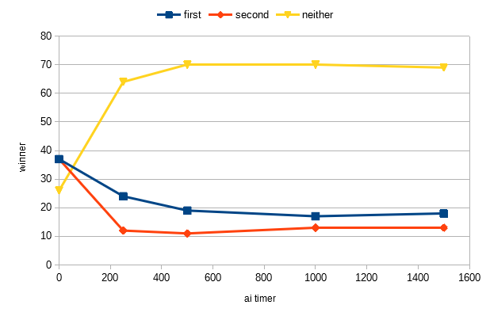

# Testing document

Most of the testing will be done with JUnit. Test classed used are included in this repository. The `HumanPlayer` class coverage is limited to basic input checking. The `AIPlayer` class is excluded from unit tests as its behavior will need to be observed empirically.

## AI performance

The AI performing can be observed by how much the time spent thinking the next move can affect its success. The hypothesis was that the proportion of ties would increase when both players are able to make more clever moves. Alternatively the other player might start to win more if the game is biased.

The following results were achieved with `java -jar ultira-ai-toe.jar -benchmark -threads=4 -timer=ms`, which gave 100 results per timer.

| ai timer (ms) | first goer wins | second goer wins | ties | avg. game length (s) |
|---------------|-----------------|------------------|------|----------------------|
| 0             | 37              | 37               | 26   | 0.002                |
| 250           | 24              | 12               | 64   | 17.117               |
| 500           | 19              | 11               | 70   | 34.346               |
| 1000          | 17              | 13               | 70   | 75.829               |
| 1500          | 18              | 13               | 69   | 104.442              |

As we can see, most games did in fact end in a tie. However the first player did always win more than the second one, so some bias is probably present. Interestingly the win distributions remained largely same from 500ms onwards. This probably means a bottleneck in the learning process that prevents the AI from making a mistake that leads to its defeat.

## JUnit coverage comprehensiveness
The progress of providing coverage for relevant classes.
* [x] structure
  * [x] Dictionary
  * [x] List
* [ ] ultirai
  * [x] Board
  * [ ] Game
  * [ ] GameState
  * [ ] SuperBoard

The unchecked boxes mark classes that I didn't get around to sufficiently cover. This was mainly due to the rapid explosion of permutations that the "superboard" ends up with that are very hard to cover. There is also a baffling bug appearing on size 4 games where the game would end with spare tiles still remaining. I didn't manage to hunt it down regardless of what I tried.
